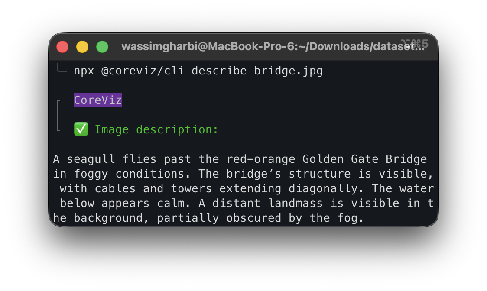
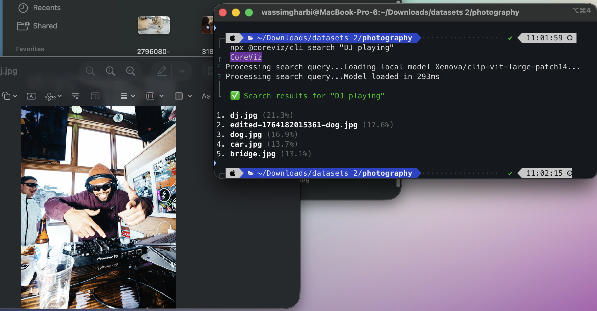

[](https://coreviz.io)

<div align="center">
    <h1>CoreViz</h1>
    <a href="https://coreviz.io/">Home</a>
    <span>&nbsp;&nbsp;•&nbsp;&nbsp;</span>
    <a href="https://lab.coreviz.io/">Studio</a>
    <span>&nbsp;&nbsp;•&nbsp;&nbsp;</span>
    <a href="https://github.com/coreviz/cli">CLI</a>
    <span>&nbsp;&nbsp;•&nbsp;&nbsp;</span>
    <a href="https://github.com/coreviz/sdk">SDK</a>
    <span>&nbsp;&nbsp;•&nbsp;&nbsp;</span>
    <a href="https://docs.coreviz.io/">Docs</a>
    <span>&nbsp;&nbsp;•&nbsp;&nbsp;</span>
    <a href="https://x.com/withcoreviz">X</a>
    <span>&nbsp;&nbsp;•&nbsp;&nbsp;</span>
    <a href="https://www.linkedin.com/company/coreviz/">LinkedIn</a>
    <span>&nbsp;&nbsp;•&nbsp;&nbsp;</span>
    <a href="mailto:team@coreviz.io">Contact</a>
  <br />
  <br />

CoreViz is a Vision AI platform for teams and individuals working with thousands of visual assets.

  <p align="center">
    <a href="https://coreviz.io"></a>
  </p>
</div>


# @coreviz/cli

<p align="center">
   <a href="https://coreviz.io"></a>
</p>

An AI-powered CLI for working with photos. Semantically search, edit, tag and generate metadata for thousands of photos right from the command line. 

## Installation

```bash
npm install -g @coreviz/cli
```

## Usage

```bash
# Run directly with npx
npx @coreviz/cli [command]

# Or if installed globally
coreviz [command]
```

## Commands
### AI Features

Describe an image:

```bash
npx @coreviz/cli describe path/to/image.jpg
```




Edit an image with a text prompt (🍌 Nano Banan + Flux Kontext in the CLI!):

```bash
npx @coreviz/cli edit path/to/image.jpg --prompt "make it cyberpunk style"
```


Generate tags or classify an image:

```bash
npx @coreviz/cli tag path/to/image.jpg "objects in the image"
```

Classify an image using specific choices:

```bash
npx @coreviz/cli tag path/to/image.jpg --choices "receipt,invoice,document" --single
```

Run tagging locally (offline capable):

```bash
npx @coreviz/cli tag path/to/image.jpg "prompt" --mode local
```

Search local images using natural language:

```bash
npx @coreviz/cli search "a person wearing a red t-shirt"
```




This will index the images in your current directory (creating a `.index.db` file) and return the top matches for your query.

You can also use the cloud API for embeddings:

```bash
npx @coreviz/cli search "query" --mode api
```


### Scripting

All commands support a `--quiet` flag to suppress UI output and return only raw results.

```bash
# Returns only the file path of the edited image
npx @coreviz/cli edit image.jpg "prompt" --quiet
```

### Authentication

Login to CoreViz using device authorization:

```bash
npx @coreviz/cli login
```

Logout:

```bash
npx @coreviz/cli logout
```

Check login status:

```bash
npx @coreviz/cli whoami
```

## Development

1. Install dependencies:
   ```bash
   cd cli
   npm install
   ```

2. Run local CLI:
   ```bash
   node bin/cli.js --help
   ```